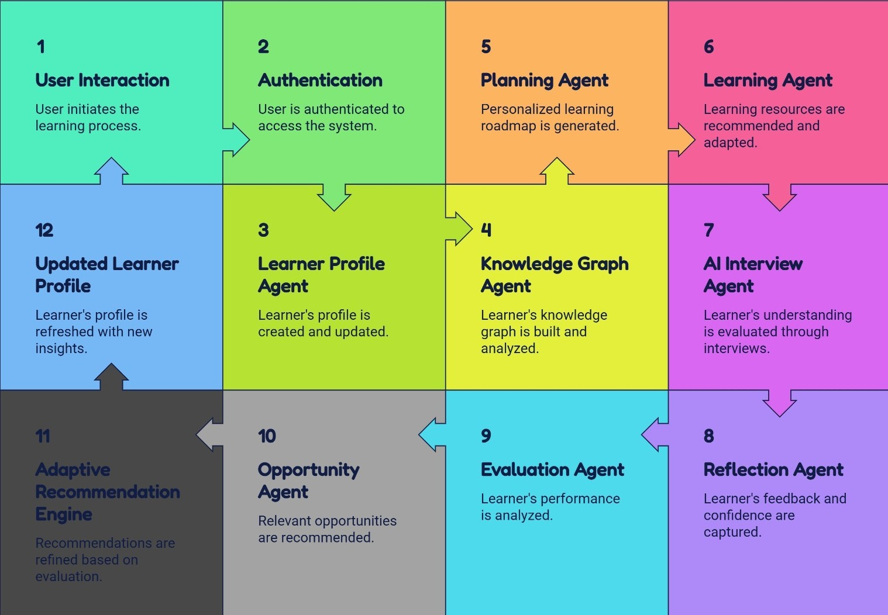
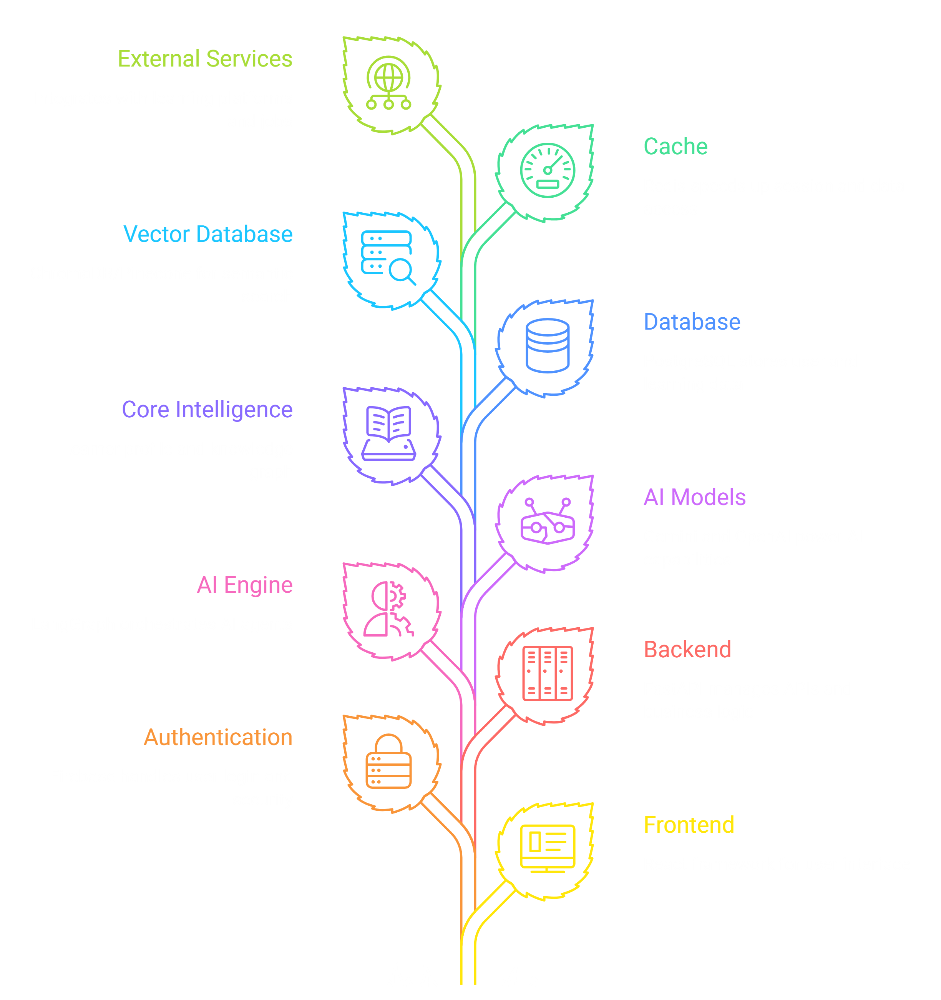

<div align="center">

      
<p align="center">
<b>"Education doesn't fail because people can't learn.  
It fails because nobody truly understands the learner."</b>
━━━━━━━━━━━━━━━━━━━━━━━━━━━━━━━━━━━━━━━  

<br>
<br>

</p>

<p align="center">


</p>

</div>

---

## 🌍 The Problem

Today's learning platforms are incredibly good at delivering content.

But they know almost nothing about **you**.

They track things like:

- ✅ Completed lessons
- ✅ Quiz scores
- ✅ Watch time
- ✅ Streaks

But they never understand

- Why you're stuck
- What you actually understand
- Why you lose motivation
- What you've already tried
- Which concepts you're missing
- How you learn best
- What your real goal is

Most platforms optimize for **content delivery.**

We optimize for **human growth potential.**

---

## 💡 Our Philosophy

Traditional Learning :-

```
Watch Video --> Quiz --> Score --> Next Video
```

COGNOS :-

```
Understand
↓
Evaluate
↓
Adapt
↓
Guide
↓
Evaluate Learning
↓
Grow
↓
Repeat
```
---

## 🚀 What is COGNOS?

COGNOS is an AI-powered Learning Engine that continuously understands the learner instead of simply recommending courses.

Instead of asking

> *"Which course should I recommend?"*

COGNOS asks

> **"What is the best thing this person should do right now to move closer to their goal?"**

That small difference changes everything.

---

## 🧠 The Learner Profile

Unlike traditional platforms, COGNOS maintains a **living learner profile as a vector.**

It continuously understands

- 🎯 Goals
- 📚 Knowledge
- 🧠 Understanding
- 💬 Communication
- ❓Reasoning
- 🔥 Motivation
- 😴 Burnout
- ⚡ Energy
- 💪 Confidence
- 📈 Progress
- 🎯 Strengths
- ⚠ Weaknesses
- 🔄 Learning Style
- 📝 Reflection History
- 🚀 Growth Momentum

Instead of storing just data,

COGNOS remembers **how you grow.**

---

## 🕸 Learning Graph

Your knowledge isn't stored as completed chapters.

It is stored as an interconnected graph.

```
Goal

↓

Skills

↓

Prerequisites

↓

Concepts

↓

Understanding

↓

Confidence

↓

Experience

↓

Reflection
```

This allows the platform to detect

- Missing concepts

- Weak foundations

- Hidden dependencies

- Knowledge gaps

before they become learning problems.

---

## 🤖 Multi-Agent Intelligence

Instead of one chatbot doing everything,

COGNOS uses specialized AI agents where each AI focuses on one responsibility & together they continuously evolve the learner even better.

<p align="center">
  
</p>

---

## 🎙 AI Learning Interviews

No more endless MCQs.

COGNOS conducts natural conversations to evaluate

- Understanding

- Reasoning

- Communication

- Practical Thinking

- Confidence

- Problem Solving

Every conversation updates your learner profile.

---

## 📖 Reflection Engine

Learning doesn't end after studying.

After every session,

COGNOS asks

- What was difficult?

- What became easier?

- What confused you?

- How confident do you feel?

These reflections become part of your learning memory.

---

## 🌱 Growth Pods

Learning shouldn't be lonely.

Join people

- with similar goals

- similar progress

- similar interests

Share

- wins

- failures

- resources

- accountability

- discussions

Grow together.

---

## 🎯 Opportunity Engine

COGNOS continuously discovers opportunities aligned with your journey.

- 🏆 Hackathons

- 💼 Internships

- 📄 Research Papers

- 🎤 Seminars

- 🚀 Competitions

- 💻 Jobs

Instead of searching,

opportunities come to you.

---

## 🏗 Tech Stack

| Layer | Technology |
|---------|------------|
| Frontend | React |
| Backend | FastAPI |
| AI | Gemini |
| Orchestration | LangGraph |
| AI Framework | LangChain |
| Database | Supabase |
| Authentication | Firebase |
| Storage | Firebase Storage |
| Vector Database | ChromaDB |
| Cache | Redis |

---

## 🏗️ System Architecture

COGNOS follows a modular **AI-powered Multi-Agent Architecture** designed to continuously understand, evaluate, and guide learners throughout their learning journey.

Instead of relying on a single AI assistant, COGNOS orchestrates multiple specialized agents using **LangGraph**, where each agent focuses on a specific responsibility while sharing a common learner profile and knowledge graph.

<p align="center">
  
</p>

### Core Design Principles

- 🧠 **Goal-First Learning** — Every recommendation begins with the learner's end goal rather than individual courses.
- 🤖 **Multi-Agent Intelligence** — Specialized AI agents collaborate through LangGraph to plan, evaluate, and adapt learning journeys.
- 🕸 **Persistent Learner Profile** — The platform continuously updates the learner's knowledge, strengths, weaknesses, motivation, confidence, and learning history.
- 🎤 **Understanding over Memorization** — AI Learning Interviews evaluate reasoning, communication, and conceptual understanding instead of MCQ scores.
- 🔄 **Continuous Adaptation** — Every interaction updates the learner profile, enabling smarter recommendations over time.
- 🌍 **Scalable & Modular** — Frontend, Backend, AI Agents, Database, and APIs are designed as independent modules for future scalability.

---

## 📁 Project Structure

The project is organized into two independent modules:

- **Frontend** – User Interface built with Flutter
- **Backend** – FastAPI server handling authentication, AI orchestration, APIs, databases, and business logic

This separation keeps the platform modular, scalable, and easy to maintain.

```
COGNOS/
│
├── FRONTEND/
│   │
│   ├── app/
│   │   ├── src/
│   │   │   ├── components/        # Reusable UI components
│   │   │   ├── pages/             # Application screens
│   │   │   ├── hooks/             # Custom React hooks
│   │   │   ├── context/           # Global state management
│   │   │   ├── lib/               # Helper functions & utilities
│   │   │   ├── App.tsx            # Root application
│   │   │   ├── main.tsx           # Entry point
│   │   │   ├── App.css
│   │   │   └── index.css
│   │   │
│   │   ├── public/                # Logos & static assets
│   │   ├── index.html
│   │   ├── package.json
│   │   ├── tailwind.config.js
│   │   ├── tsconfig.json
│   │   └── vite.config.ts
│
├── BACKEND/
│   │
│   ├── main.py                    # FastAPI application entry
│   ├── auth.py                    # Authentication & authorization
│   ├── database.py                # Database connection
│   ├── models.py                  # SQLAlchemy models
│   ├── schemas.py                 # Request/response schemas
│   ├── routes.py                  # API endpoints
│   ├── services.py                # Business logic
│   ├── agents.py                  # LangGraph AI agents
│   ├── graph.py                   # Agent workflow orchestration
│   ├── interview.py               # AI Interview Engine
│   ├── learner_profile.py         # Learner Profile Engine
│   ├── knowledge_graph.py         # Knowledge Graph logic
│   ├── recommendation.py          # Adaptive recommendation engine
│   ├── utils.py                   # Helper utilities
│
├── assets/                        # README images & architecture diagrams
├── docs/                          # Documentation
├── LICENSE
├── .gitignore
├── requirements.txt               # requirements for locally running the project
└── README.md
```

---

## Impact

*🎯 Personalized Learning Paths - <br>*
Every learner follows a roadmap adapted to their goals, knowledge, and progress.

*🧠 Earlier Concept Gap Detection - <br>*
Knowledge gaps can be identified before they become major learning obstacles.

*⏳ Reduced Time Wasted - <br>*
Learners spend less time revising concepts they already understand.

*📈 Better Long-Term Retention - <br>*
Continuous interviews and reflection reinforce understanding over memorization.

---

## 🌎 Vision

We don't want to build another EdTech platform.

We want to build the operating system that helps people learn anything, become anyone, and continuously grow throughout life.

---

## 💎 Authors
Built by: **Team Future Forgers**
- Bhavesh Gudlani
- Nilesh Kukreja
- Rohit Hallur
- Sankalp Mudkanna


